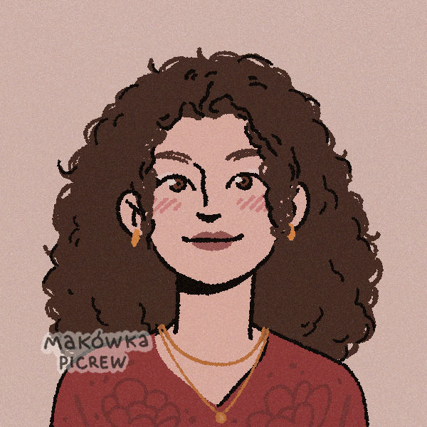

<!DOCTYPE html>
<html lang="pt-br">
<head>
  <meta charset="UTF-8" />
  <meta name="viewport" content="width=device-width, initial-scale=1.0"/>
  <title>Portfólio B.E.L</title>
  <link rel="stylesheet" href="style.css" />
</head>
<body>
  <header>
    <h1 class="titulo rosa">Equipe B.E.L</h1>
    <nav>
      <ul>
        <li><a href="#sobre">Sobre</a></li>
        <li><a href="#projetos">Projetos</a></li>
        <li><a href="#contato">Contato</a></li>
      </ul>
    </nav>
  </header>

  <section id="sobre">
    <h2 class="titulo amarelo">Sobre os membros da equipe</h2>
    <h3 class=>Beatriz</h3>
    
Sou uma profissional eficaz, sempre me empenho profundamente nos projetos que me são empregados, sempre buscando o melhor que se pode atingir. Comunico-me de forma fluida com as pessoas, como também trabalho de forma sublime em equipe, resolvo problemas de modo veloz e inovador. Constantemente busco aprimorar minhas habilidades e conhecimento, dessa forma, meu trabalho estará sempre atualizado e de acordo a necessidade do mercado.

    <h3 class=>Estela</h3>

    
Sou uma pessoa criativa, com facilidade para gerar ideias inovadoras e encontrar soluções originais. Possuo exelente comunicação, expressando me de forma clara e objetiva, o que contribui para a construção de relações eficazes. Demonstro também forte espírito de colaboração, destacando me em trabalhos em equipe com atitude proativa, respeito e cooperação.

     <h3 class=>Laura</h3>
    Sou uma pessoa dedicada e disciplinada, com grande capacidade de organização e planejamento nos estudos. Demonstro constância e comprometimento com prazos, mantendo um ritmo de aprendizado eficaz. Mostro iniciativa para buscar novos conhecimentos e tenho facilidade em aplicar o que aprendo de forma prática.

  </section>

  <section id="projetos">
    <h2 class="titulo azul">Projetos</h2>
    

      <h3>Projeto 1- Chico Coins</h3>
      
Esse projeto foi desenvolvido por meio da paltaforma Scratch, ele consiste na contação das aventuras e desventuras de três amigos que assaltam um banco. Nesse projeto foi utilizado recorte e montagem de imagens, bem como a criação de desenvolvimento de personagem e narrativa.

      <a href="https://scratch.mit.edu/projects/1017654689">Ver no Scratch</a>
    

    

      <h3>Projeto 2- Aplicativo</h3>
      
Nesse projeto foi realizado um aplicativo para axiliar estudantes que se preparam para o ENEM, com recomendações de artigos e notícis, bem como, sujestões de prosportas de redação com temas prováveis a aserem abordados no ENEM.

      <a href="https://www.figma.com/design/eS8kkBGUV4VD1umZtSfaW0/Figma-basics?node-id=601-10&t=9JPFQP6gs9SCUsJK-1">Ver no Figma</a>
    

    

      <h3>Projeto 3- Casa do Ipiranga</h3>
      
O projeto da Casa do Ipiranga comtempla a área da escrita em prosa com uso de linguagem formal, ele foi desenvolvido para eleborar uma proposta de resolução e disponibilizar ifomações acerca da situação nociva que se entra a aCasa do Ipiranga .

      <a href="https://docs.google.com/document/d/e/2PACX-1vQVblu9I6ykkcqJ9wGEx7L0hIuYv7aOKyHQGjMVPvWG3bBdUaUm2CapqMDPDaJ2PL5BmiA4-EpHkeUg/pub">Ver no GooglesDoc</a>
     

  </section>

  <section id="contato">
    <h2 class="titulo verde">Contato</h2>
    
Entre em contato via e-mails: <a href="beatriz.pirani@escola.pr.gov.br"
                                       >beatriz.pirani@escola.pr.gov.br</a>

                                      <a href="estela.silva.diniz@escola.pr.gov.br"
                                       >estela.silva.diniz@escola.pr.gov.br</a>

                                      <a href="laura.cavalheiro@escola.pr.gov.br"
                                        >laura.cavalheiro@escola.pr.gov.br</a>

                                     
  </section>

  <footer>
    
&copy; 2025 Beatriz Freiberger Pirani

  </footer>

  
</body>
</html>
